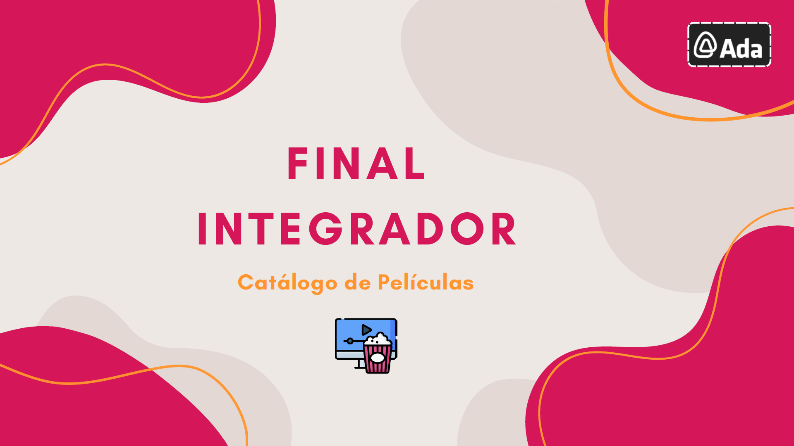

    

## <ins>Catálogo de películas "Ada"</ins> 🌸:

Este catálogo de películas permite llevar un registro de tus películas favoritas. Puedes agregarlas a catálogos según su género, poder verlas ordenadamente y eliminarlas si ya no son de tu preferencia o interés.

### <ins>Opciones</ins>:

1. **Agregar película**:

    Puedes agregar tus películas ingresando el título, quién la dirigió, su año de lanzamiento y el género a la que corresponde.

2. **Listar películas**:

    Puedes ver tus películas agregadas al catálogo en una lista, por orden de ingreso. ¿A que no es genial? 😎

3. **Eliminar catálogo de películas**:

    Elimina el catálogo de películas del que ya no quieres llevar un registro, ya sea porque son películas que viste o que ya no te interesen ver.
    
4. **Salir**:

    La forma más apropiada de cerrar un ciclo es con estilo ✨
    Presiona esta opción para finalizar el programa con un bonito mensaje.

### <ins>¿Cómo puedo usar este catálogo?</ins>:

1. **Clonar repositorio**:

    Abrir Git Bash en tu computadora, en la ubicación que desees clonar el repositorio del catálogo. Una vez allí, ejecutar el comando **`git clone https://github.com/nvcamarota/catalogo_peliculas`**.

2. **Abrir catálogo**:

    En una terminal, ubicar la ruta de la carpeta dónde se encuentra el archivo **`catálogo_películas.py`** y posicionarse allí. Una vez realizado, ejecutar el comando **`python catálogo_películas.py`** para iniciar el programa.

3. **Cerrar catálogo**:

    Para cerrar el juego desde la consola, presionar las teclas "Ctrl + C" para finalizar el programa. En el caso de querer cerrar la consola desde donde se abrió el juego, presionar las teclas "Alt + F4".
